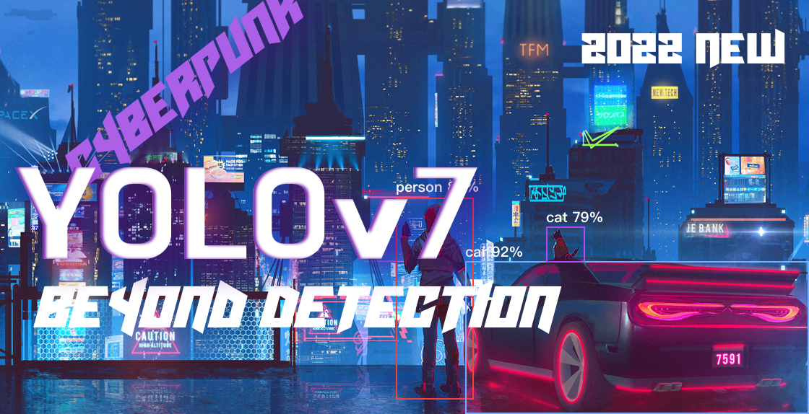

[][1]
[][2]
[][3]
[][4]
[][5]


[][6]

[][8]


[1]: https://pytorch.org

[2]: https://www.facebook.com/syun128

[3]: https://wandb.ai/site

[4]: https://fastapi.tiangolo.com/

[5]: https://github.com/Syun1208

[6]: https://join.skype.com/invite/x3bJIhveDnae

[7]: https://git.sunshinetech.vn/dev/ai/icr/idc-transformation.git

[8]: https://www.linkedin.com/in/syun-cet


---
<!-- PROJECT LOGO -->
<br />
<div align="center">
    <h3>Hi, I'm Long, author of this repository 🚀.</h3>
  <a>
    
  </a>

<h1 align="center">VIETNAMESE ID CARD DETECTION BASED ON YOLOV7</h1>
</div>


<!-- TABLE OF CONTENTS -->
<details>
  <summary>Table of Contents</summary>
  <ol>
    <li>
      <a href="#about-the-project">About The Project</a>
      <ul>
        <li><a href="#frame-works-and-environments">Frameworks and Environments</a></li>
      </ul>
    </li>
    <li>
      <a href="#getting-started">Getting Started</a>
      <ul>
        <li><a href="#prerequisites">Prerequisites</a></li>
        <li><a href="#installation">Installation</a></li>
        <li><a href="#implementation">Implementation</a></li>
      </ul>
    </li>
    <li><a href="#roadmap">Roadmap</a></li>
    <li><a href="#contributing">Contributing</a></li>
    <li><a href="#contact">Contact</a></li>
  </ol>
</details>


<!-- ABOUT THE PROJECT -->

## About The Project

<a>
    
</a>

* In this day and age, we have many model detection such as Faster-RCNN, SDD, YOLO, and so on.
* More specifically, we will apply the lastest version of YOLO, namely YOLOv7.
  In order to take ROI in ID Card, we additionally use Perspective Transform based on
  4 orientations of image, namely top-left, top-right, bottom-left, bottom-right.
* However, when we cut the ROI in image completely, the orientation of image is not correct. Moreover, many applications
  have used
  classification model to category the corners such as CNN, ResNet50, AlexNet, and so on. But this method will
  be low inference.
* Therefore, we decide to apply mathematics so as to calculate the corner replied on the orientated
  vector of top-left and top-right that we will describe in this repository.

### Frameworks and Environments

* [][1]
* [][4]
* 
* 

<!-- GETTING STARTED -->

## Getting Started

### Prerequisites

<a>
    
</a>

First of all, we need to install anaconda environment.

* conda
    ```sh
    conda create your_conda_environment
    conda activate your_conda_environment
    ```

Then, we install our frameworks and libraries by using pip command line.

* pip
  ```shell
  pip install -r path/to/requirements.txt
  ```

We suggest that you should use python version 3.8.12 to implement this repository.

### Installation

1. Check CUDA and install Pytorch with conda
    ```sh
    nvidia-smi
    conda install pytorch torchvision torchaudio cudatoolkit=11.3 -c pytorch
    ```
2. Clone the repository
   ```sh
   git clone https://github.com/Syun1208/IDCardDetectionAndRecognition.git
   ```

### Implementation

1. Preprocessing Data

* If you want custom datasets(json) to yolo's bounding box, please run this command line.
    ```sh
    python path/to/data/preprocessing/convertJson2YOLOv5Label.py --folderBoundingBox path/to/labels --folderImage path/to/images --imageSaveBoundingBox path/to/save/visualization --jsonPath path/to/json/label 
    ```
* If you want custom datasets(json) to yolo's polygon and 4 corners of images, please run this command line.
    ```sh
    python path/to/data/preprocessing/convertJson2YOLOv54Corners.py --folderBoundingBox path/to/save/labels --folderPolygon path/to/save/labels --folderImage path/to/images --imageSaveBoundingBox path/to/save/visualization --imageSavePolygon path/to/save/visualization --jsonPath path/to/json/label
    ```

2. Testing on local computer

* Put your image's option and run to see the result
  ```sh
  python path/to/main.py --weights path/to/weight.onnx --cfg-detection yolov7 --img_path path/to/image 
  ```

3. Testing on API

* You need change your local host and port which you want to config
  ```sh
  python path/to/fast_api.py --local_host your/local/host --port your/port
  ```

<!-- ROADMAP -->

## Roadmap

- [x] Data Cleaning
- [x] Preprocessing Data
- [x] Model Survey and Selection
- [x] Do research on paper
- [x] Configuration and Training Model
- [x] Testing and Evaluation
- [x] Implement Correcting Image Orientation
- [x] Build Docker and API using FastAPI
- [x] Write Report and Conclusion

See the [open issues](https://github.com/othneildrew/Best-README-Template/issues) for a full list of proposed features (
and known issues).


<!-- CONTRIBUTING -->

## Contributing

1. Fork the Project
2. Create your Feature Branch

* `git checkout -b exist/folder`

3. Commit your Changes

* `git commit -m 'Initial Commit'`

4. Push to the Branch

* `git remote add origin https://git.sunshinetech.vn/dev/ai/icr/idc-transformation.git`
* `git branch -M main`
* `git push -uf origin main`

5. Open a Pull Request

<!-- CONTACT -->

## Contact

My Information - [LinkedIn](https://www.linkedin.com/in/syun-cet/) - longpm@unicloud.com.vn

Project
Link: [https://github.com/Syun1208/IDCardDetectionAndRecognition.git](https://github.com/your_username/repo_name)


<!-- ACKNOWLEDGMENTS -->

## Acknowledgments

* [Unicloud Group](https://unicloud.com.vn/)
* [Leader: Kieu-Anh Nguyen](https://www.linkedin.com/in/kieefuanh/)